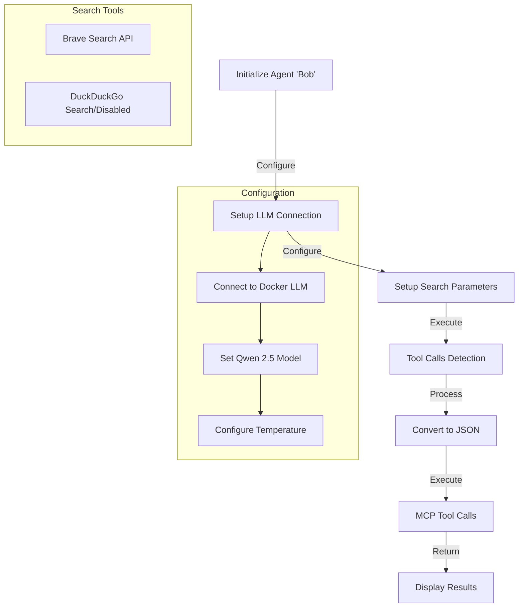

# AI-Powered Search Agent

A Go-based intelligent search agent that leverages the `robby` framework to perform automated web searches.

## Overview

This agent, nicknamed "Bob", is designed to perform AI-assisted web searches using Docker-based Language Models (LLMs). It specifically searches for Docker-related information and processes the results through an AI model.

## Architecture

## Technical Details

### Configuration
- **Model**: Qwen 2.5 (`ai/qwen2.5:latest`)
- **Endpoint**: `http://model-runner.docker.internal`
- **Temperature**: 0.0 (for consistent responses)
- **Parallel Processing**: Enabled

### Search Providers
- **Primary**: Brave Search (requires API key)
- **Alternative**: DuckDuckGo (commented out, rate-limited)

### Features
- Parallel tool execution
- JSON-formatted results
- Limited to 3 search results
- Docker MCP toolkit integration
- Error handling for tool execution

## Requirements

- Go runtime environment
- Docker setup
- Brave Search API key
- Local LLM instance

## Usage Notes

- The agent returns exactly 3 search results
- Brave Search requires API key configuration
- DuckDuckGo can be used as a fallback option
- Results are displayed in both JSON and processed formats

## Error Handling

The agent includes basic error handling for:
- Tool execution failures
- JSON conversion issues
- MCP tool call execution