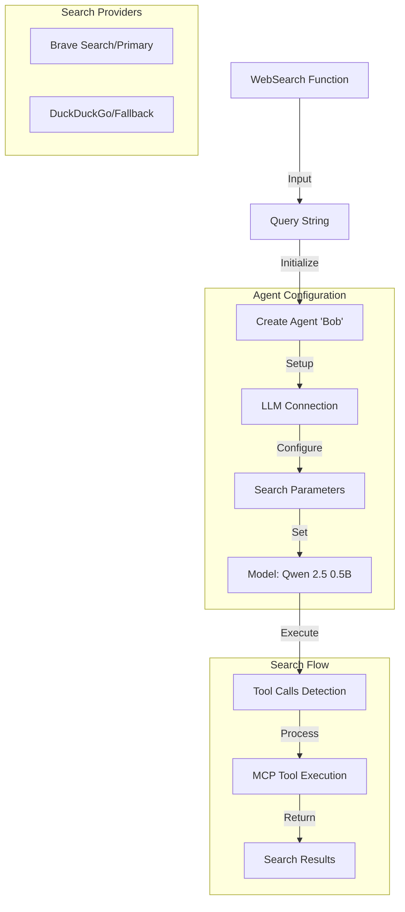

# AI-Powered Search Function

A Go implementation of a modular search function that uses the `robby` framework to perform intelligent web searches.

## Overview

This implementation provides a reusable `WebSearch` function that leverages AI-powered search capabilities. It uses a lightweight Qwen 2.5 model (0.5B parameters) to process search queries efficiently while maintaining search quality.

## Architecture



## Technical Details

### Function Signature
```go
func WebSearch(query string) ([]string, error)
```

### Configuration
- **Model**: Qwen 2.5 0.5B (`ai/qwen2.5:0.5B-F16`)
- **Endpoint**: `http://model-runner.docker.internal/engines/llama.cpp/v1/`
- **Temperature**: 0.0 (deterministic responses)
- **Parallel Processing**: Enabled

### Search Features
- Modular function design
- Efficient smaller model usage
- Error handling
- Multiple search backend support
- Parallel tool execution

## Requirements

- Go runtime environment
- Docker setup
- Brave Search API key
- Local LLM instance

## Usage Example

```go
results, err := WebSearch("Search the latests information about Docker. (Only 3 results)")
if err != nil {
    // Handle error
}
// Process results
```

## Implementation Notes

- Uses a smaller model variant for better performance
- Supports both Brave and DuckDuckGo search backends
- Returns search results as string array
- Includes comprehensive error handling
- Configured for parallel tool execution