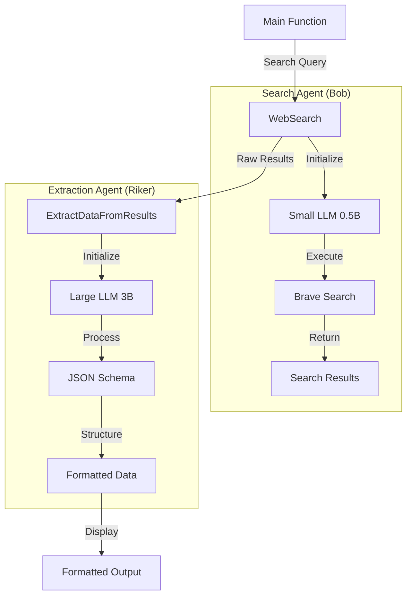

# AI-Powered Search and Data Extraction

A Go implementation that combines web search capabilities with structured data extraction using the `robby` framework and LLM processing.

## Overview

This implementation provides two main functions:
- `WebSearch`: Performs AI-powered web searches
- `ExtractDataFromResults`: Processes search results into structured data

## Architecture



## Technical Details

### Data Models
```go
type SearchResult struct {
    Title   string
    URL     string
    Summary string
}
```

### Configuration

#### Search Agent
- **Model**: Qwen 2.5 0.5B (`ai/qwen2.5:0.5B-F16`)
- **Purpose**: Efficient web searching
- **Features**: Parallel tool execution

#### Extraction Agent
- **Model**: Qwen 2.5 3B (`ai/qwen2.5:3B-F16`)
- **Purpose**: Complex data extraction
- **Output**: JSON-structured data

### Key Features
- Two-stage processing pipeline
- JSON schema validation
- Structured data extraction
- Error handling
- Model size optimization
- Parallel search capabilities

## Usage Example

```go
// Perform search
results, _ := WebSearch("Search query")

// Extract structured data
data, _ := ExtractDataFromResults(results)

// Access structured fields
for _, item := range data {
    fmt.Printf("Title: %s\n", item["title"])
    fmt.Printf("URL: %s\n", item["url"])
    fmt.Printf("Summary: %s\n", item["summary"])
}
```

## Implementation Notes

- Uses different model sizes for different tasks:
  - Small model (0.5B) for search queries
  - Large model (3B) for data extraction
- Includes JSON schema validation
- Supports multiple search backends
- Provides structured data output
- Implements comprehensive error handling

## Requirements

- Go runtime environment
- Docker setup
- Local LLM instance
- Brave Search API key (for search functionality)