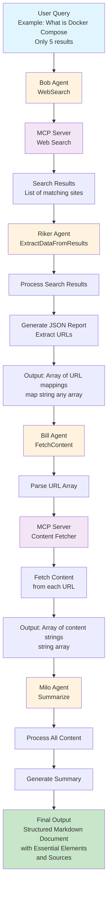

# Bob, Riker, Bill et Milo : Une Équipe d'Agents IA pour une Recherche Web Intelligente avec Docker Model Runner et MCP Toolkit
> Réaliser un pipeline d'Agents IA avec Docker Model Runner

## Introduction

Dans le précédent blog post j'expliquais comment implémenter une version du pattern AI Agent en Go avec Docker Model Runner et le Docker MCP Toolkit. Le blog post était "plutôt long", et finalement, le plus souvent c'est par l'exemple que l'on apprend le mieux. Donc aujourd'hui prenons un cas concret. 

J'aimerais pouvoir faire des recherches web "améliorées". Par exemple, pouvoir demander `"What is Docker Compose? (Only 5 results)"` et obtenir à la fin un document markdown structuré avec les éléments essentiels et les sources utilisées.

Pour cela je vais avoir besoin de 4 agents:

- **Bob**, pour les recherches internet (`WebSearch`): obtenir une liste de sites correspondants au texte de ma recherche. **Bob** utilisera un serveur MCP pour effectuer les recherches.
- **Riker**, qui à partir des résultat de **Bob**, va générer un report au format JSON pour extraire notamment les URLs des résultats de recherche (`ExtractDataFromResults`) et le fournir sous la forme d'un tableau de map `[]map[string]any`.
- **Bill**, va parcourir le tableau de map fourni par **Riker** et récupérer le contenu de chacune des URLs (`FetchContent`) pour les restituer sous la forme d'un tableau de strings `[]string`. **Bill** utilisera un serveur MCP pour récupérer les contenus.
- Et enfin, **Milo** qui à partir de tout ce contenu va générer un résumé de ses recherches (`Summarize`).

Il est possible de le faire avec moins d'agents. Je pense même que je pourrais le faire avec un seul (cf. [Hybrid Prompts with Docker Model Runner and the MCP Toolkit](https://k33g.hashnode.dev/hybrid-prompts-with-docker-model-runner-and-the-mcp-toolkit)). Mais la possibilité de découper le travail et de le répartir sur plusieurs agents va me permettre de choisir des modèles plus petits et donc d'**accélérer** certaines tâches tout en **consommant moins de ressources** et aussi utiliser les modèles les plus adaptés à telle ou telle tâche. 



## Pré-requis

- Docker Desktop
- Installer l'extension **Docker MCP Toolkit**
- Installer les serveurs MCP suivants (via Docker MCP Toolkit):

- **[Brave Search](https://github.com/docker/labs-ai-tools-for-devs/blob/main/prompts/mcp/readmes/brave.md)** pour les recherches web. Vous aurez besoin d'une clé d'API. **Brave** propose un plan gratuit qui est largement suffisant poue ce type d'exemple: [https://brave.com/search/api/] ou le [serveur MCP **DuckDuckGo**](https://github.com/docker/labs-ai-tools-for-devs/blob/main/prompts/mcp/readmes/duckduckgo.md), mais attention il est soumis à une limitation de nombre de requêtes.
- **[Fetch](https://github.com/docker/labs-ai-tools-for-devs/blob/main/prompts/mcp/readmes/fetch.md)** pour extraire le contenu de pages et le rendre au format markdown.

J'explique comment utiliser **Docker MCP Toolkit** dans ce blog post: [Boosting Docker Model Runner with Docker MCP Toolkit](https://k33g.hashnode.dev/boosting-docker-model-runner-with-docker-mcp-toolkit)

> **Remarque**: Je voulais ré-utiliser le code de l'article précédent: [Minimalist Implementation of an AI Agent with Docker Model Runner and Docker MCP Toolkit](https://k33g.hashnode.dev/minimalist-implementation-of-an-ai-agent-with-docker-model-runner-and-docker-mcp-toolkit). J'ai donc transformé ce code en une librairie: [https://github.com/sea-monkeys/robby](https://github.com/sea-monkeys/robby). J'insiste, c'est une librairie, pas un framework. Son objectif est juste de me faciliter la vie dans mon utilisation du SDK Go d'OpenAI et des serveurs MCP (et d'autres petits outils).

## Le programme principal

Le programme principal va exécuter 4 fonctions successives:
- `WebSearch`: je fais une requête web: `"What is Docker Compose? (Only 3 results)"`
- `ExtractDataFromResults`: j'en extraits les informations pour les structurer (récupérer les URLs)
- `FetchContent`: pour chaque URL, je récupère le contenu de la page associée
- `Summarize`: je résume et met en forme les contenus

Chaque fonction "contient" un AI Agent dont la responsabilité est d'exécuter une tâche bien précise. Et son résultat sera utilisé par l'agent suivant, jusqu'à l'obtention du résultat attendu.

```golang
func main() {

	results, err := WebSearch("What is Docker Compose? (Only 3 results)")
	if err != nil {
		fmt.Println("Error:", err)
		return
	}

	data, err := ExtractDataFromResults(results)
	if err != nil {
		fmt.Println("Error extracting data:", err)
		return
	}

	content, err := FetchContent(data)

	if err != nil {
		fmt.Println("Error fetching content:", err)
		return
	}

	_, err = Summarize(`/no_think [Brief]
		Make a clear, and structured summaryt with the provided information.
		- Use markdown format.
		- Provide only verified refrences (URLs).
		- Stay focused and do not repeat the same information.	
		- Do not use any other external information.
		- Do not include the error messages in the report.
	`, content)

	if err != nil {
		fmt.Println("Error summarizing content:", err)
		return
	}

}
```
> J'ai prévu d'utiliser **[ai/qwen3](https://hub.docker.com/r/ai/qwen3)** pour le LLM du dernier agent. L'utilisation de `/no_think` en début de prompt, permet de désactiver le mode raisonnement du modèle 

Donc maintenant il ne nous reste plus qu'à implémenter les 4 fonctions.

## C'est parti, on commence par Bob pour les recherches Web

J'ai donc besoin d'un agent pour envoyer des requêtes à un moteur de recherche. J'ai donc codé un agent (**"Bob"**) en utilisant [https://github.com/sea-monkeys/robby](https://github.com/sea-monkeys/robby), cette agent sera sollicité à l'aide d'une fonction `WebSearch`. L'utilisation de la fonction apporte plus de lisibilité dans le code principal de la fonction `main`:

```golang

func WebSearch(query string) ([]string, error) {
	model := "ai/qwen2.5:0.5B-F16"
	Bob, _ := robby.NewAgent(
		robby.WithDMRClient(
			context.Background(),
			"http://model-runner.docker.internal/engines/llama.cpp/v1/",
		),
		robby.WithParams(
			openai.ChatCompletionNewParams{
				Model: model,
				Messages: []openai.ChatCompletionMessageParamUnion{
					openai.UserMessage(query),
				},
				Temperature:       openai.Opt(0.0),
				ParallelToolCalls: openai.Bool(true),
			},
		),
		robby.WithMCPClient(robby.WithDockerMCPToolkit()),
		robby.WithMCPTools([]string{"search"}), // `search` is a tool of DuckDuckGo
	)

	// Execute the tool calls == tool calls detection
	_, err := Bob.ToolsCompletion()
	if err != nil {
		return nil, err
	}

	toolCallsJSON, _ := Bob.ToolCallsToJSON()
	fmt.Println("Tool Calls:", toolCallsJSON)

	// Execute the tool calls and get the results
	results, _ := Bob.ExecuteMCPToolCalls()
	
	// Display the results
	for _, result := range results {
		fmt.Println(result)
	}
	fmt.Println("Web Search Results completed ✅")

	return results, nil
}
```

Cette fonction va créer un agent "Bob" qui va "faire" du **function calling** en utilisant l'outil `search` du serveur MCP **DuckDuckGo**. Je décris en détail le fonctionnement du **function calling** dans ce post: [Function Calling with Docker Model Runner](https://k33g.hashnode.dev/function-calling-with-docker-model-runner).

L'exécution d'outil détecté va être la suivante:
```json
[
    {
        "function": {
            "arguments": {
                "max_results": 3,
                "query": "Docker Compose"
            },
            "name": "search"
        },
        "id": "ykRuqixONp9UQzIJzwvwV8jXeyMSQMyj"
    }
]
```

Le résultat va être le suivant:

```json
Found 3 search results:

1. Docker Compose | Docker Docs - Docker Documentation
   URL: https://docs.docker.com/compose/
   Summary: DockerComposeis a tool for defining and running multi-container applications. It is the key to unlocking a streamlined and efficient development and deployment experience.Composesimplifies the control of your entire application stack, making it easy to manage services, networks, and volumes in a single YAML configuration file. ...

2. Docker Compose - GeeksforGeeks
   URL: https://www.geeksforgeeks.org/docker-compose/
   Summary: Learn how to useDockerComposeto run and manage multiple containers in a YAML-based file. See key concepts, configuration options, examples, and best practices forDockerCompose.

3. GitHub - docker/compose: Define and run multi-container applications ...
   URL: https://github.com/docker/compose
   Summary: DockerComposeis a tool for running multi-container applications onDockerdefined using theComposefile format. AComposefile is used to define how one or more containers that make up your application are configured. Once you have aComposefile, you can create and start your application with a single command:dockercomposeup.
```

**À noter**: j'ai utilisé un "tout petit" LLM: `ai/qwen2.5:0.5B-F16`, qui tout à fait suffisant pour cette détection d'outil. L'avantage c'est que l'agent chargera le LLM et exécutera la complétion **beaucoup plus rapidement**.

Nous allons ensuite avoir besoin d'extraire les URLs de ce contenu. Pour cela nous allons utiliser le principe du JSON Output Format qui permet aux LLMs qui le supportent de générer des réponses au format JSON. J'ai écrit un post sur ce principe: [Generating Structured Data with Docker Model Runner](https://k33g.hashnode.dev/generating-structured-data-with-docker-model-runner). Passons donc à la création du deuxième agent


## Et maintenant, Riker pour l'extraction des données

Je code donc une deuxième fonction nommée `ExtractDataFromResults` qui ca créer un deuxième agent (**"Riker"**), qui va utiliser les données générées par **"Bob"** (via la fonction `WebSearch`) pour, à partir d'un schéma JSON, va générer une payload JSON et ensuite la transformer en `[]map[string]any`:

```golang
func ExtractDataFromResults(results []string) ([]map[string]any, error) {

	// NOTE: ai/qwen2.5:0.5B-F16 and ai/qwen2.5:1.5B-F16 are too small for this task
	model := "ai/qwen2.5:3B-F16"

	schema := map[string]any{
		"type": "array",
		"items": map[string]any{
			"type": "object",
			"properties": map[string]any{
				"title": map[string]any{
					"type":        "string",
					"description": "The first line of the section",
				},
				"url": map[string]any{
					"type": "string",
				},
				"summary": map[string]any{
					"type":        "string",
					"description": "A short summary of the section",
				},
			},
			"required": []string{"title", "url", "summary"},
		},
	}

	schemaParam := openai.ResponseFormatJSONSchemaJSONSchemaParam{
		Name:        "search_results",
		Description: openai.String("Notable information about search results"),
		Schema:      schema,
		Strict:      openai.Bool(true),
	}

	Riker, _ := robby.NewAgent(
		robby.WithDMRClient(
			context.Background(),
			"http://model-runner.docker.internal/engines/llama.cpp/v1/",
		),
		robby.WithParams(
			openai.ChatCompletionNewParams{
				Model: model,
				Messages: []openai.ChatCompletionMessageParamUnion{
					openai.SystemMessage(strings.Join(results, "\n")),
					openai.UserMessage("give me the list of the results."),
				},
				Temperature: openai.Opt(0.0),
				ResponseFormat: openai.ChatCompletionNewParamsResponseFormatUnion{
					OfJSONSchema: &openai.ResponseFormatJSONSchemaParam{
						JSONSchema: schemaParam,
					},
				},
			},
		),
	)
	jsonResults, err := Riker.ChatCompletion()
	if err != nil {
		return nil, err
	}

	fmt.Println("📝 JSON Results:\n", jsonResults)

	// Transform the json string into a map
	var jsonResultsMap []map[string]any
	err = json.Unmarshal([]byte(jsonResults), &jsonResultsMap)
	if err != nil {
		return nil, err
	}

	fmt.Println("Extracted Data from Results completed ✅")
	return jsonResultsMap, nil
}
```

Le résultat va être le suivant:

```json
[
    {
        "summary":"Docker Compose | Docker Docs - Docker Documentation",
        "title":"Docker Compose",
        "url":"https://docs.docker.com/compose/"
    },
    {
        "summary":"Docker Compose - GeeksforGeeks",
        "title":"Docker Compose",
        "url":"https://www.geeksforgeeks.org/docker-compose/"
    },
    {
        "summary":"GitHub - docker/compose: Define and run multi-container applications ...",
        "title":"Docker Compose",
        "url":"https://github.com/docker/compose"
    }
]
```

Nous avons donc maintenant une liste structurée avec 3 enregistrements, ce qui va nous permettre de demander à l'agent suivant de construire un prompt à partir de ces résultats pour lui faire accomplir à son tour du **function calling**.

**À noter**: j'ai utilisé un LLM plus gros: `ai/qwen2.5:3B-F16`, les LLM plus petits n'étaient pas capables de générer une payload JSON avec toutes les données nécessaires.


## Le 3éme agent, Bill pour le chargement des données

Je crée donc une nouvelle fonction `FetchContent`, qui va créer un nouvel agent (**"Bill"**) qui va être en charge d'aller charger le contenu de chacunes des URLs fournie par l'agent précédent (**"Riker"**) via la fonction `ExtractDataFromResults`:

```golang
func FetchContent(data []map[string]any) ([]string, error) {

	model := "ai/qwen2.5:0.5B-F16"

	Bill, _ := robby.NewAgent(
		robby.WithDMRClient(
			context.Background(),
			"http://model-runner.docker.internal/engines/llama.cpp/v1/",
		),
		robby.WithParams(
			openai.ChatCompletionNewParams{
				Model:             model,
				Messages:          []openai.ChatCompletionMessageParamUnion{},
				Temperature:       openai.Opt(0.0),
				ParallelToolCalls: openai.Bool(true),
			},
		),
		robby.WithMCPClient(robby.WithDockerMCPToolkit()),
		robby.WithMCPTools([]string{"fetch"}),
	)

	prompt := ""
	for _, result := range data {
		prompt += fmt.Sprintf("Fetch this URL: %s\n", result["url"])
	}

	fmt.Println("🛠️ Prompt for tool calls:")
	fmt.Println(prompt)

	Bill.Params.Messages = []openai.ChatCompletionMessageParamUnion{
		openai.UserMessage(prompt),
	}

	_, err := Bill.ToolsCompletion()
	if err != nil {
		return nil, fmt.Errorf("error in tools completion: %w", err)
	}

	toolCallsJSON, _ := Bill.ToolCallsToJSON()
	fmt.Println("Tool Calls:", toolCallsJSON)

	results, err := Bill.ExecuteMCPToolCalls()
	if err != nil {
		return nil, fmt.Errorf("error executing tool calls: %w", err)
	}

	fmt.Println("Fetched Content completed ✅")

	return results, nil
}
```

Cette fois ci, nous allons utiliser l'outil `fetch` du serveur MCP **Fetch**

On construit donc un nouveau prompt pour le nouvel agent à partir des informations de **"Riker"**:
```raw
🛠️ Prompt for tool calls:
Fetch this URL: https://docs.docker.com/compose/
Fetch this URL: https://www.geeksforgeeks.org/docker-compose/
Fetch this URL: https://github.com/docker/compose
```

Le LLM va exécuter une "Tools Complétion" et détecter qu'il y a 3 tool calls dans le prompt:

```json
[
    {
        "function": {
            "arguments": {
                "raw": false,
                "start_index": 0,
                "url": "https://docs.docker.com/compose/"
            },
            "name": "fetch"
        },
        "id": "Jra4ZcOe7DY3mv1ZnTqZ6Fe0GfLzidrK"
    },
    {
        "function": {
            "arguments": {
                "raw": false,
                "start_index": 0,
                "url": "https://www.geeksforgeeks.org/docker-compose/"
            },
            "name": "fetch"
        },
        "id": "DcSrxiFvI5nJYtKPUe8b3IPwwJeTbAGN"
    },
    {
        "function": {
            "arguments": {
                "raw": false,
                "start_index": 0,
                "url": "https://github.com/docker/compose"
            },
            "name": "fetch"
        },
        "id": "9WcYM9d6BvCL7J1ZbcI0ci8ciz9XHbYW"
    }
]
```

Ensuite, l'agent va exécuter à partir de cette liste, les 3 appels successifs de l'outil `fetch` du serveur MCP **Fetch**.
Et enfin la fonction retournera les résultats des fetchs sous la forme d'un tableau de strings (`[]string`).

Et nous pourrons finalement transmettre ces contenus à un dernier agent pour la "mise en forme".

**À noter**: j'ai pu à nouveau utilisé un "tout petit" LLM: `ai/qwen2.5:0.5B-F16`.

## Mise en place du dernier agent Milo pour la mise en forme des données

C'est la dernière fonction, `Summarize` qui va fournir au dernier agent (**Milo**) le contenu (fourni par **Bill** via la fonction `FetchContent`) à traiter ainsi que les instructions à appliquer pour la mise en forme du résultat. Cette fois ci, le travail de l'agent est simple, puisqu'il effectue une complétion de chat tout ce qu'il y a de plus classique:

```golang
func Summarize(instructions string, content []string) (string, error) {

	model := "ai/qwen3:latest"

	Milo, _ := robby.NewAgent(
		robby.WithDMRClient(
			context.Background(),
			"http://model-runner.docker.internal/engines/llama.cpp/v1/",
		),
		robby.WithParams(
			openai.ChatCompletionNewParams{
				Model: model,
				Messages: []openai.ChatCompletionMessageParamUnion{
					openai.SystemMessage(strings.Join(content, "\n")),
					openai.UserMessage(instructions),
				},
				Temperature: openai.Opt(0.0),
				TopP:        openai.Opt(0.3), // Lowering TopP to reduce randomness
				// NOTE: To limit hallucinations and obtain more reliable responses,
				// lower both the “temperature” and “top_p” parameters.
				// This forces the model to choose the safest and most predictable answers.

			},
		),
	)
	result, err := Milo.ChatCompletionStream(func(self *robby.Agent, content string, err error) error {

		fmt.Print(content)
		return nil
	})
	if err != nil {
		return "", fmt.Errorf("error in ChatCompletionStream: %w", err)
	}
	fmt.Println("\nReport Generated ✅")
	return result, nil
}
```

Et nous obtiendrons un rapport markdown de ce type:

```markdown
# Summary of Docker Compose

Docker Compose is a tool for defining and running multi-container applications using a YAML file. It simplifies the management of services, networks, and volumes in a single configuration file. Below is a structured summary of the key information provided from the given sources.

---

## 🔧 Key Concepts in Docker Compose

- **Docker Compose File (YAML Format)**: The main configuration file is `docker-compose.yml`, which defines services, networks, and volumes.
  - **Version**: Specifies the format of the Compose file.
  - **Services**: Each service represents a containerized application component.
  - **Networks**: Custom networks for communication between containers.
  - **Volumes**: For data persistence and sharing between containers.

- **Services**: Each service runs a single container and can be configured with options like image, environment variables, and resource limits.

- **Networks**: Custom networks allow services to communicate with each other.

- **Volumes**: Used for data persistence and sharing between containers.

---

## 📁 Docker Compose File Example

```yaml
version: '3.8'

services:
  web:
    image: nginx:latest
    ports:
      - "80:80"
    networks:
      - frontend
    volumes:
      - shared-volume:/usr/share/nginx/html
    depends_on:
      - app

  app:
    image: node:14
    working_dir: /app
    command: node server.js
    networks:
      - frontend
    volumes:
      - shared-volume:/app/data

networks:
  frontend:
    driver: bridge

volumes:
  shared-volume:
```

---

## 🚀 Why Use Docker Compose?

- Simplifies the management of multi-container applications.
- Provides a single YAML file for defining services, networks, and volumes.
- Supports the entire lifecycle of an application (start, stop, rebuild, etc.).
- Works in all environments (development, testing, production, CI/CD).

---

## 📚 Docker Compose Commands

- `docker compose up`: Start services defined in the `docker-compose.yml` file.
- `docker compose down`: Stop and remove containers, networks, and volumes.
- `docker compose build`: Build services defined in the `docker-compose.yml` file.
- `docker compose logs`: View the logs of running services.
- `docker compose ps`: List containers started by Compose.

---

## 📚 References

- [Docker Compose Documentation](https://docs.docker.com/compose/)
- [Docker Compose on GeeksforGeeks](https://www.geeksforgeeks.org/docker-compose/)
- [GitHub Repository for Docker Compose](https://github.com/docker/compose)

---

## 📌 Best Practices

- Use a single `docker-compose.yml` file for managing all services.
- Define custom networks for better isolation and communication.
- Use volumes for data persistence and sharing.
- Keep the Compose file version up to date for compatibility.

---

## 📌 Features

- Multi-container application support.
- YAML-based configuration.
- Integration with Docker Swarm.
- One-off commands for running tasks on services.
- Lifecycle management commands.

---

## 📌 Installation

- **Windows and macOS**: Included in Docker Desktop.
- **Linux**: Download binaries from the [GitHub release page](https://github.com/docker/compose/releases) and install them.

---

## 📌 Conclusion

Docker Compose is a powerful tool for managing multi-container applications. It simplifies the setup and management of services, networks, and volumes, making it an essential part of modern DevOps workflows
```

Voilà, maintenant, à partir de 4 fonctions réutilisables, je dispose d'un système de recherche sur le web améliorée. Bien sûr c'est très largement améliorable, mais l'objectif était de montrer qu'il était finalement assez simple de fabriquer des applications d'IA génératives en découpant et distribuant les responsabilités à plusieurs agents.
