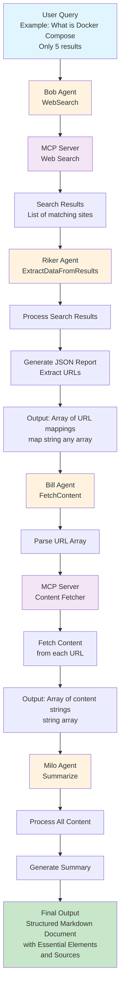

# Bob, Riker, Bill and Milo: An AI Agent Team for Intelligent Web Search with Docker Model Runner and MCP Toolkit
> Building an AI Agent pipeline with Docker Model Runner

## Introduction

In the previous blog post, I explained how to implement a version of the AI Agent pattern in Go with Docker Model Runner and the Docker MCP Toolkit. The blog post was "quite long", and ultimately, we often learn best through examples. So today let's take a concrete case.

I would like to be able to perform "enhanced" web searches. For example, being able to ask `"What is Docker Compose? (Only 5 results)"` and get a structured markdown document with the essential elements and sources used at the end.

For this I will need 4 agents:

- **Bob**, for internet searches (`WebSearch`): get a list of sites corresponding to the text of my search. **Bob** will use an MCP server to perform the searches.
- **Riker**, who from **Bob**'s results, will generate a JSON report to extract notably the URLs from the search results (`ExtractDataFromResults`) and provide it in the form of a map array `[]map[string]any`.
- **Bill**, will go through the map array provided by **Riker** and retrieve the content of each URL (`FetchContent`) to return them in the form of a string array `[]string`. **Bill** will use an MCP server to retrieve the contents.
- And finally, **Milo** who from all this content will generate a summary of his research (`Summarize`).

It's possible to do it with fewer agents. I even think I could do it with just one (cf. [Hybrid Prompts with Docker Model Runner and the MCP Toolkit](https://k33g.hashnode.dev/hybrid-prompts-with-docker-model-runner-and-the-mcp-toolkit)). But the ability to break down the work and distribute it across multiple agents will allow me to choose smaller models and thus **accelerate** certain tasks while **consuming fewer resources** and also use the models most suited to particular tasks.



## Prerequisites

- Docker Desktop
- Install the **Docker MCP Toolkit** extension
- Install the following MCP servers (via Docker MCP Toolkit):

- **[Brave Search](https://github.com/docker/labs-ai-tools-for-devs/blob/main/prompts/mcp/readmes/brave.md)** for web searches. You will need an API key. **Brave** offers a free plan that is largely sufficient for this type of example: [https://brave.com/search/api/] or the [**DuckDuckGo** MCP server](https://github.com/docker/labs-ai-tools-for-devs/blob/main/prompts/mcp/readmes/duckduckgo.md), but be careful as it is subject to a request number limitation.
- **[Fetch](https://github.com/docker/labs-ai-tools-for-devs/blob/main/prompts/mcp/readmes/fetch.md)** to extract page content and render it in markdown format.

I explain how to use **Docker MCP Toolkit** in this blog post: [Boosting Docker Model Runner with Docker MCP Toolkit](https://k33g.hashnode.dev/boosting-docker-model-runner-with-docker-mcp-toolkit)

> **Note**: I wanted to reuse the code from the previous article: [Minimalist Implementation of an AI Agent with Docker Model Runner and Docker MCP Toolkit](https://k33g.hashnode.dev/minimalist-implementation-of-an-ai-agent-with-docker-model-runner-and-docker-mcp-toolkit). So I transformed this code into a library: [https://github.com/sea-monkeys/robby](https://github.com/sea-monkeys/robby). I insist, it's a library, not a framework. Its goal is just to make my life easier in my use of the OpenAI Go SDK and MCP servers (and other small tools).

## The Main Program

The main program will execute 4 successive functions:
- `WebSearch`: I make a web query: `"What is Docker Compose? (Only 3 results)"`
- `ExtractDataFromResults`: I extract information from it to structure it (retrieve URLs)
- `FetchContent`: for each URL, I retrieve the content of the associated page
- `Summarize`: I summarize and format the contents

Each function "contains" an AI Agent whose responsibility is to execute a very specific task. And its result will be used by the next agent, until obtaining the expected result.

```golang
func main() {

	results, err := WebSearch("What is Docker Compose? (Only 3 results)")
	if err != nil {
		fmt.Println("Error:", err)
		return
	}

	data, err := ExtractDataFromResults(results)
	if err != nil {
		fmt.Println("Error extracting data:", err)
		return
	}

	content, err := FetchContent(data)

	if err != nil {
		fmt.Println("Error fetching content:", err)
		return
	}

	_, err = Summarize(`/no_think [Brief]
		Make a clear, and structured summary with the provided information.
		- Use markdown format.
		- Provide only verified references (URLs).
		- Stay focused and do not repeat the same information.	
		- Do not use any other external information.
		- Do not include the error messages in the report.
	`, content)

	if err != nil {
		fmt.Println("Error summarizing content:", err)
		return
	}

}
```
> I planned to use **[ai/qwen3](https://hub.docker.com/r/ai/qwen3)** for the LLM of the last agent. Using `/no_think` at the beginning of the prompt allows disabling the model's reasoning mode

So now we just need to implement the 4 functions.

## Let's start with Bob for Web Searches

I need an agent to send queries to a search engine. So I coded an agent (**"Bob"**) using [https://github.com/sea-monkeys/robby](https://github.com/sea-monkeys/robby), this agent will be called using a `WebSearch` function. Using the function brings more readability to the main code of the `main` function:

```golang

func WebSearch(query string) ([]string, error) {
	model := "ai/qwen2.5:0.5B-F16"
	Bob, _ := robby.NewAgent(
		robby.WithDMRClient(
			context.Background(),
			"http://model-runner.docker.internal/engines/llama.cpp/v1/",
		),
		robby.WithParams(
			openai.ChatCompletionNewParams{
				Model: model,
				Messages: []openai.ChatCompletionMessageParamUnion{
					openai.UserMessage(query),
				},
				Temperature:       openai.Opt(0.0),
				ParallelToolCalls: openai.Bool(true),
			},
		),
		robby.WithMCPClient(robby.WithDockerMCPToolkit()),
		robby.WithMCPTools([]string{"search"}), // `search` is a tool of DuckDuckGo
	)

	// Execute the tool calls == tool calls detection
	_, err := Bob.ToolsCompletion()
	if err != nil {
		return nil, err
	}

	toolCallsJSON, _ := Bob.ToolCallsToJSON()
	fmt.Println("Tool Calls:", toolCallsJSON)

	// Execute the tool calls and get the results
	results, _ := Bob.ExecuteMCPToolCalls()
	
	// Display the results
	for _, result := range results {
		fmt.Println(result)
	}
	fmt.Println("Web Search Results completed ✅")

	return results, nil
}
```

This function will create a "Bob" agent that will perform **function calling** using the `search` tool from the **DuckDuckGo** MCP server. I describe in detail how **function calling** works in this post: [Function Calling with Docker Model Runner](https://k33g.hashnode.dev/function-calling-with-docker-model-runner).

The detected tool execution will be as follows:
```json
[
    {
        "function": {
            "arguments": {
                "max_results": 3,
                "query": "Docker Compose"
            },
            "name": "search"
        },
        "id": "ykRuqixONp9UQzIJzwvwV8jXeyMSQMyj"
    }
]
```

The result will be as follows:

```json
Found 3 search results:

1. Docker Compose | Docker Docs - Docker Documentation
   URL: https://docs.docker.com/compose/
   Summary: DockerComposeis a tool for defining and running multi-container applications. It is the key to unlocking a streamlined and efficient development and deployment experience.Composesimplifies the control of your entire application stack, making it easy to manage services, networks, and volumes in a single YAML configuration file. ...

2. Docker Compose - GeeksforGeeks
   URL: https://www.geeksforgeeks.org/docker-compose/
   Summary: Learn how to useDockerComposeto run and manage multiple containers in a YAML-based file. See key concepts, configuration options, examples, and best practices forDockerCompose.

3. GitHub - docker/compose: Define and run multi-container applications ...
   URL: https://github.com/docker/compose
   Summary: DockerComposeis a tool for running multi-container applications onDockerdefined using theComposefile format. AComposefile is used to define how one or more containers that make up your application are configured. Once you have aComposefile, you can create and start your application with a single command:dockercomposeup.
```

**Note**: I used a "very small" LLM: `ai/qwen2.5:0.5B-F16`, which is quite sufficient for this tool detection. The advantage is that the agent will load the LLM and execute the completion **much faster**.

We will then need to extract the URLs from this content. For this we will use the principle of JSON Output Format which allows LLMs that support it to generate responses in JSON format. I wrote a post on this principle: [Generating Structured Data with Docker Model Runner](https://k33g.hashnode.dev/generating-structured-data-with-docker-model-runner). Let's move on to creating the second agent.

## And now, Riker for Data Extraction

I code a second function named `ExtractDataFromResults` which will create a second agent (**"Riker"**), which will use the data generated by **"Bob"** (via the `WebSearch` function) to, from a JSON schema, generate a JSON payload and then transform it into `[]map[string]any`:

```golang
func ExtractDataFromResults(results []string) ([]map[string]any, error) {

	// NOTE: ai/qwen2.5:0.5B-F16 and ai/qwen2.5:1.5B-F16 are too small for this task
	model := "ai/qwen2.5:3B-F16"

	schema := map[string]any{
		"type": "array",
		"items": map[string]any{
			"type": "object",
			"properties": map[string]any{
				"title": map[string]any{
					"type":        "string",
					"description": "The first line of the section",
				},
				"url": map[string]any{
					"type": "string",
				},
				"summary": map[string]any{
					"type":        "string",
					"description": "A short summary of the section",
				},
			},
			"required": []string{"title", "url", "summary"},
		},
	}

	schemaParam := openai.ResponseFormatJSONSchemaJSONSchemaParam{
		Name:        "search_results",
		Description: openai.String("Notable information about search results"),
		Schema:      schema,
		Strict:      openai.Bool(true),
	}

	Riker, _ := robby.NewAgent(
		robby.WithDMRClient(
			context.Background(),
			"http://model-runner.docker.internal/engines/llama.cpp/v1/",
		),
		robby.WithParams(
			openai.ChatCompletionNewParams{
				Model: model,
				Messages: []openai.ChatCompletionMessageParamUnion{
					openai.SystemMessage(strings.Join(results, "\n")),
					openai.UserMessage("give me the list of the results."),
				},
				Temperature: openai.Opt(0.0),
				ResponseFormat: openai.ChatCompletionNewParamsResponseFormatUnion{
					OfJSONSchema: &openai.ResponseFormatJSONSchemaParam{
						JSONSchema: schemaParam,
					},
				},
			},
		),
	)
	jsonResults, err := Riker.ChatCompletion()
	if err != nil {
		return nil, err
	}

	fmt.Println("📝 JSON Results:\n", jsonResults)

	// Transform the json string into a map
	var jsonResultsMap []map[string]any
	err = json.Unmarshal([]byte(jsonResults), &jsonResultsMap)
	if err != nil {
		return nil, err
	}

	fmt.Println("Extracted Data from Results completed ✅")
	return jsonResultsMap, nil
}
```

The result will be as follows:

```json
[
    {
        "summary":"Docker Compose | Docker Docs - Docker Documentation",
        "title":"Docker Compose",
        "url":"https://docs.docker.com/compose/"
    },
    {
        "summary":"Docker Compose - GeeksforGeeks",
        "title":"Docker Compose",
        "url":"https://www.geeksforgeeks.org/docker-compose/"
    },
    {
        "summary":"GitHub - docker/compose: Define and run multi-container applications ...",
        "title":"Docker Compose",
        "url":"https://github.com/docker/compose"
    }
]
```

We now have a structured list with 3 records, which will allow us to ask the next agent to build a prompt from these results to make it perform **function calling** in turn.

**Note**: I used a larger LLM: `ai/qwen2.5:3B-F16`, smaller LLMs were not capable of generating a JSON payload with all the necessary data.

## The 3rd Agent, Bill for Data Loading

I create a new function `FetchContent`, which will create a new agent (**"Bill"**) who will be in charge of loading the content of each URL provided by the previous agent (**"Riker"**) via the `ExtractDataFromResults` function:

```golang
func FetchContent(data []map[string]any) ([]string, error) {

	model := "ai/qwen2.5:0.5B-F16"

	Bill, _ := robby.NewAgent(
		robby.WithDMRClient(
			context.Background(),
			"http://model-runner.docker.internal/engines/llama.cpp/v1/",
		),
		robby.WithParams(
			openai.ChatCompletionNewParams{
				Model:             model,
				Messages:          []openai.ChatCompletionMessageParamUnion{},
				Temperature:       openai.Opt(0.0),
				ParallelToolCalls: openai.Bool(true),
			},
		),
		robby.WithMCPClient(robby.WithDockerMCPToolkit()),
		robby.WithMCPTools([]string{"fetch"}),
	)

	prompt := ""
	for _, result := range data {
		prompt += fmt.Sprintf("Fetch this URL: %s\n", result["url"])
	}

	fmt.Println("🛠️ Prompt for tool calls:")
	fmt.Println(prompt)

	Bill.Params.Messages = []openai.ChatCompletionMessageParamUnion{
		openai.UserMessage(prompt),
	}

	_, err := Bill.ToolsCompletion()
	if err != nil {
		return nil, fmt.Errorf("error in tools completion: %w", err)
	}

	toolCallsJSON, _ := Bill.ToolCallsToJSON()
	fmt.Println("Tool Calls:", toolCallsJSON)

	results, err := Bill.ExecuteMCPToolCalls()
	if err != nil {
		return nil, fmt.Errorf("error executing tool calls: %w", err)
	}

	fmt.Println("Fetched Content completed ✅")

	return results, nil
}
```

This time, we will use the `fetch` tool from the **Fetch** MCP server.

We build a new prompt for the new agent from **"Riker"**'s information:
```raw
🛠️ Prompt for tool calls:
Fetch this URL: https://docs.docker.com/compose/
Fetch this URL: https://www.geeksforgeeks.org/docker-compose/
Fetch this URL: https://github.com/docker/compose
```

The LLM will execute a "Tools Completion" and detect that there are 3 tool calls in the prompt:

```json
[
    {
        "function": {
            "arguments": {
                "raw": false,
                "start_index": 0,
                "url": "https://docs.docker.com/compose/"
            },
            "name": "fetch"
        },
        "id": "Jra4ZcOe7DY3mv1ZnTqZ6Fe0GfLzidrK"
    },
    {
        "function": {
            "arguments": {
                "raw": false,
                "start_index": 0,
                "url": "https://www.geeksforgeeks.org/docker-compose/"
            },
            "name": "fetch"
        },
        "id": "DcSrxiFvI5nJYtKPUe8b3IPwwJeTbAGN"
    },
    {
        "function": {
            "arguments": {
                "raw": false,
                "start_index": 0,
                "url": "https://github.com/docker/compose"
            },
            "name": "fetch"
        },
        "id": "9WcYM9d6BvCL7J1ZbcI0ci8ciz9XHbYW"
    }
]
```

Then, the agent will execute from this list, the 3 successive calls of the `fetch` tool from the **Fetch** MCP server.
And finally the function will return the fetch results in the form of a string array (`[]string`).

And we can finally transmit these contents to a final agent for "formatting".

**Note**: I was again able to use a "very small" LLM: `ai/qwen2.5:0.5B-F16`.

## Setting up the Last Agent Milo for Data Formatting

This is the last function, `Summarize` which will provide the last agent (**Milo**) with the content (provided by **Bill** via the `FetchContent` function) to process as well as the instructions to apply for formatting the result. This time, the agent's work is simple, since it performs a classic chat completion:

```golang
func Summarize(instructions string, content []string) (string, error) {

	model := "ai/qwen3:latest"

	Milo, _ := robby.NewAgent(
		robby.WithDMRClient(
			context.Background(),
			"http://model-runner.docker.internal/engines/llama.cpp/v1/",
		),
		robby.WithParams(
			openai.ChatCompletionNewParams{
				Model: model,
				Messages: []openai.ChatCompletionMessageParamUnion{
					openai.SystemMessage(strings.Join(content, "\n")),
					openai.UserMessage(instructions),
				},
				Temperature: openai.Opt(0.0),
				TopP:        openai.Opt(0.3), // Lowering TopP to reduce randomness
				// NOTE: To limit hallucinations and obtain more reliable responses,
				// lower both the "temperature" and "top_p" parameters.
				// This forces the model to choose the safest and most predictable answers.

			},
		),
	)
	result, err := Milo.ChatCompletionStream(func(self *robby.Agent, content string, err error) error {

		fmt.Print(content)
		return nil
	})
	if err != nil {
		return "", fmt.Errorf("error in ChatCompletionStream: %w", err)
	}
	fmt.Println("\nReport Generated ✅")
	return result, nil
}
```

And we will get a markdown report like this (it's only an extract of the entire output):

```markdown
# Summary of Docker Compose

Docker Compose is a tool for defining and running multi-container applications using a YAML file. It simplifies the management of services, networks, and volumes in a single configuration file. Below is a structured summary of the key information provided from the given sources.

---

## 🔧 Key Concepts in Docker Compose

- **Docker Compose File (YAML Format)**: The main configuration file is `docker-compose.yml`, which defines services, networks, and volumes.
  - **Version**: Specifies the format of the Compose file.
  - **Services**: Each service represents a containerized application component.
  - **Networks**: Custom networks for communication between containers.
  - **Volumes**: For data persistence and sharing between containers.

- **Services**: Each service runs a single container and can be configured with options like image, environment variables, and resource limits.

- **Networks**: Custom networks allow services to communicate with each other.

- **Volumes**: Used for data persistence and sharing between containers.

---

## 📚 References

- [Docker Compose Documentation](https://docs.docker.com/compose/)
- [Docker Compose on GeeksforGeeks](https://www.geeksforgeeks.org/docker-compose/)
- [GitHub Repository for Docker Compose](https://github.com/docker/compose)

```

There you have it, now, from 4 reusable functions, I have an enhanced web search system. Of course it's greatly improvable, but the objective was to show that it was ultimately quite simple to build generative AI applications by breaking down and distributing responsibilities to multiple agents.

You can find the complete code for this article here: [https://github.com/sea-monkeys/forbidden-planet/blob/main/05-generate-text/main.go](https://github.com/sea-monkeys/forbidden-planet/blob/main/05-generate-text/main.go)
